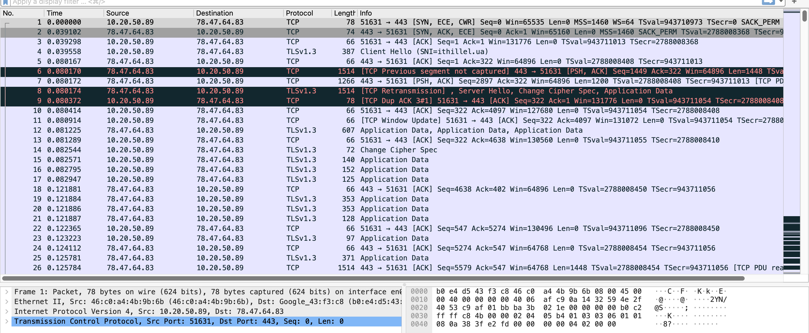
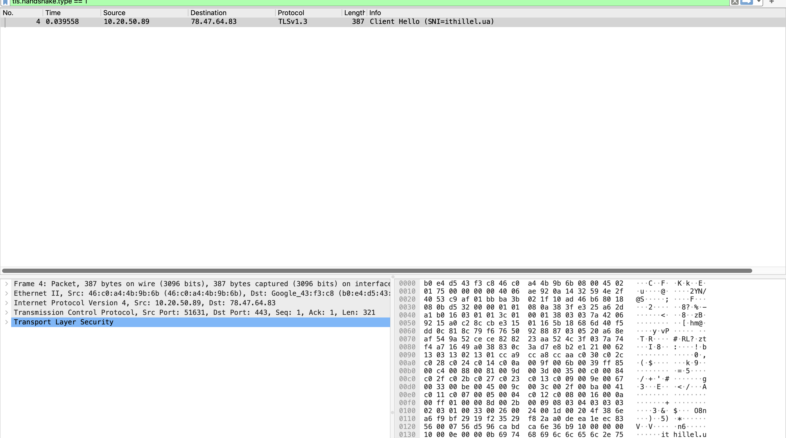
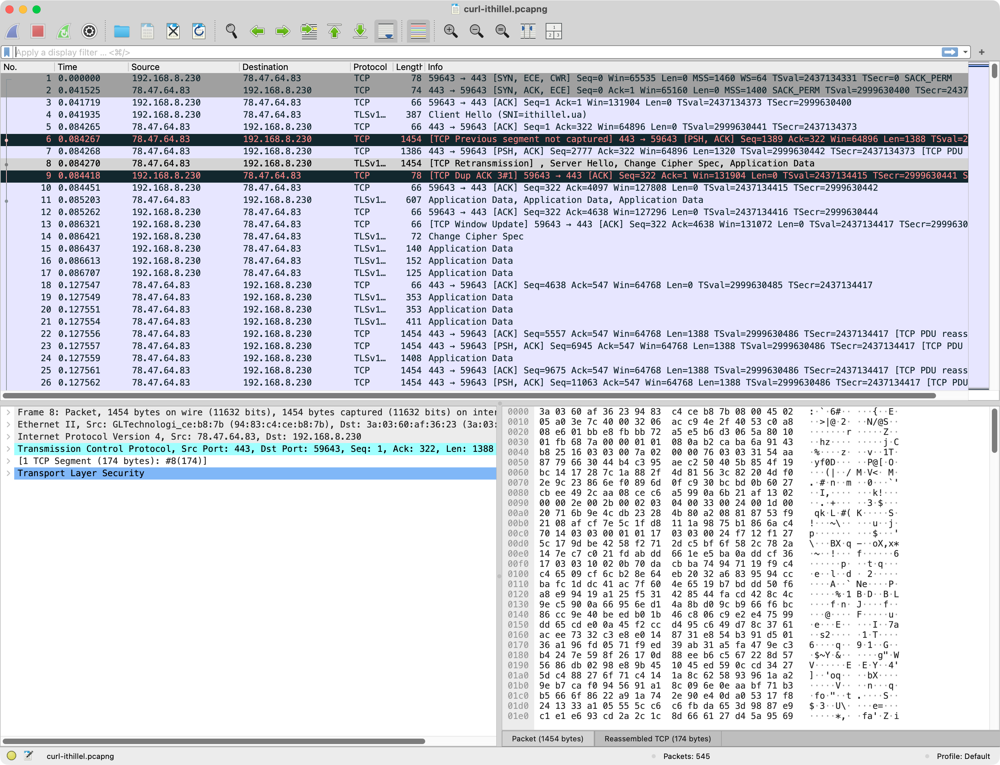

# Домашнє завдання 06 — Мережі. Частина 3

**Автор:** Андрій Пономарьов<br>
**Середовище:** macOS, Wireshark 4.6.7<br>
**Інструменти:** `dig`, `route`, `traceroute`, `curl`, `tshark`, `openssl`;
Claude Code — редактура

**Завдання:** наскрізний розбір шляху до сайту — dig (A, AAAA, NS, SOA) →
route → traceroute; дамп трафіку під час `curl -v` і в Wireshark знайти
TCP handshake, ClientHello з SNI та першу відповідь; виміряти фази
`curl -w` (DNS, TCP, TLS, перший байт) і визначити найдовшу;
`openssl s_client` — хто підписав сертифікат, скільки днів лишилось, чи
відданий весь ланцюжок. Опціонально: оцінка на ssllabs.com, порівняння з
конфігом ssl-config.mozilla.org, 5 речень про власний сервіс.

Обраний сайт: **ithillel.ua** (сайт школи; у ДЗ 4 був github.com — цього
разу цікавіший кейс: DNS на Cloudflare, а хостинг у Hetzner).

> Примітка: робота виконувалась на macOS, тому замість `ip route get` —
> нативний `route -n get`. Дамп знято tshark'ом (консольний Wireshark),
> аналіз — у Wireshark GUI.

> Оновлення 27.07.2026: топологія мережі змінилась — ноутбук тепер
> «схований» за новим роутером (GL.iNet), який сам підключається по Wi-Fi
> до старого Google-роутера (каскад, подвійний NAT). Усі практичні кроки
> (dig, route, traceroute, дамп, curl -w, openssl) прогнано повторно,
> скріншоти перезнято. Моя мережа тепер 192.168.8.0/24 зі шлюзом
> 192.168.8.1; у traceroute додався один хоп, а в TCP handshake став
> помітний MSS 1400 — деталі в розділах 2–4.

---

## Коротко про результат

| Пункт | Результат |
|---|---|
| DNS і маршрут | ithillel.ua → Hetzner; DNS — Cloudflare; локально доступний лише IPv4-маршрут |
| Traceroute | 13 хопів ICMP, кінцева затримка близько 40–43 мс |
| Wireshark | TCP handshake — кадри 1–3; ClientHello з SNI — кадр 4; ServerHello — кадр 8 |
| Продуктивність | DNS 3 мс; TCP +40 мс; TLS +46 мс; TTFB +46 мс; тіло +206 мс |
| Сертифікат | Let's Encrypt YR2, 70 днів до завершення; переданий повний потрібний ланцюжок |
| TLS-профіль | SSL Labs A+; TLS 1.2/1.3; є застарілі CBC-набори для TLS 1.2 |

---

## 1. dig — чотири типи записів

```
$ dig A    ithillel.ua   → 78.47.64.83            (TTL 228)
$ dig AAAA ithillel.ua   → 2a01:4f8:c012:dc97::1  (TTL 238)
$ dig NS   ithillel.ua   → coco.ns.cloudflare.com, norm.ns.cloudflare.com
$ dig SOA  ithillel.ua   → coco.ns.cloudflare.com. dns.cloudflare.com.
                           2408945412 10000 2400 604800 1800
```

**Що це означає:**

- **A** — сайт живе на 78.47.64.83. За whois це **Hetzner Online**,
  дата-центр Falkenstein (Німеччина).
- **AAAA** — є й IPv6-адреса, 2a01:4f8:... — той самий Hetzner Cloud.
  Тобто сервер доступний по обох протоколах.
- **NS** — зону обслуговують сервери **Cloudflare**. При цьому A-запис
  віддає прямий IP Hetzner, а не 104.x: DNS на Cloudflare є, а
  проксі-режим («помаранчева хмаринка») вимкнено — трафік іде напряму на
  сервер.
- **SOA** — «паспорт зони»: первинний NS (coco.ns.cloudflare.com),
  контакт адміна (dns.cloudflare.com → dns@cloudflare.com), серійний
  номер зони 2408945412 і таймери: refresh 10000 с (як часто secondary
  перевіряє оновлення), retry 2400 с, expire 604800 с (тиждень — і
  secondary перестає відповідати за зону), negative TTL 1800 с (скільки
  кешується відповідь «такого запису немає»).

Відповідав резолвер провайдера 10.255.255.1 (той самий, що й до заміни
роутера), запити — 10–23 мс. Показово, що всі чотири записи, включно з
серійним номером SOA 2408945412, за два дні не змінились — зона стабільна.
Повний вивід: [docs/dig-output.txt](docs/dig-output.txt).

## 2. route — куди піде пакет

```
$ route -n get ithillel.ua
   route to: 78.47.64.83
    gateway: 192.168.8.1
  interface: en0
        mtu: 1500

$ route -n get -inet6 2a01:4f8:c012:dc97::1
route: writing to routing socket: not in table
```

**Що це означає:** IPv4-шлях звичайний — адреса не локальна, пакет піде
через шлюз 192.168.8.1 (новий роутер) з Wi-Fi-інтерфейсу en0. А от
IPv6-запит показовий:
AAAA-запис у сайта **є**, але маршруту до нього в перевіреній конфігурації
**немає** — рівно той висновок, що й у ДЗ 5 (локально лише link-local;
новий роутер, на відміну від старого, не роздає навіть ULA). Тому `curl -v`
нижче чесно пише `IPv6: (none)` і йде по IPv4.
Повний вивід: [docs/route-output.txt](docs/route-output.txt).

## 3. traceroute — шлях пакета

```
$ traceroute -I -n -w 2 -m 20 ithillel.ua
 1  192.168.8.1     2.2 ms   ← мій новий роутер (перший NAT)
 2  10.20.48.1      4.9 ms   ← старий Google-роутер (другий NAT)
 3  10.12.18.1      4.4 ms   ← приватна мережа провайдера
 4  10.1.1.3        5.3 ms
 5  91.226.254.3    5.7 ms   ← публічна адреса провайдера (IPORT)
 6  185.1.63.223   47.0 ms   ← обмінна точка Giganet global IX
 7  213.239.224.218 46.0 ms  ← магістраль Hetzner (AS24940)
 8  213.239.224.181 41.7 ms
 9  * 213.239.227.197 41.4 ms
10-11  * * *
12  136.243.181.18 40.5 ms   ← core-роутер ДЦ Falkenstein (fsn1-dc8)
13  78.47.64.83    43.3 ms   ← сервер ithillel.ua
```

**Що це означає:** до сайту тепер — **13 хопів** (було 12), і додатковий
хоп — це прямий наслідок нової топології: ноутбук сидить за новим роутером
(192.168.8.1), який сам підключається по Wi-Fi до старого Google-роутера.
Хоп 2 (10.20.48.1) — це і є старий роутер, тільки видний з іншого боку:
для сегмента, в який вчепився новий роутер, він відповідає як 10.20.48.1,
а на своїй «старій» адресі 10.20.50.1 (мій шлюз із ДЗ 4) він досі живий —
`traceroute 10.20.50.1` доходить до нього тим самим другим хопом. Тобто
пакет тепер проходить **два домашні NAT** поспіль (192.168.8.0/24 →
10.20.x.x), і лише потім — мережу провайдера. Далі шлях ідентичний
попередньому прогону: приватні адреси провайдера, публічна IPORT, IX,
Hetzner.

Стрибок затримки ~5 → ~47 мс на хопі 6 збігається з переходом на
міжоператорський маршрут через обмінну точку; далі видно адреси Hetzner і
кінцевий сервер. За одним traceroute не можна точно визначити географічну
межу. UDP-варіант після 12-го хопа отримує лише `*`, тоді як ICMP (`-I`)
доходить до сервера; це свідчить про різну фільтрацію або політику
відповідей уздовж маршруту, але не локалізує її на самому сервері. Повний
вивід обох варіантів: [docs/traceroute-output.txt](docs/traceroute-output.txt).

## 4. Дамп під час curl -v: handshake, ClientHello з SNI, перша відповідь

Захоплення tshark'ом на en0 з фільтром `host 78.47.64.83`, паралельно —
`curl -v https://ithillel.ua/`. Дамп: [docs/curl-ithillel.pcapng](docs/curl-ithillel.pcapng),
вивід curl: [docs/curl-v-output.txt](docs/curl-v-output.txt).

### TCP handshake (кадри 1–3)

```
1  0.000000  192.168.8.230 → 78.47.64.83   [SYN, ECE, CWR] Seq=0 MSS=1460
2  0.041525  78.47.64.83   → 192.168.8.230 [SYN, ACK, ECE] Seq=0 Ack=1 MSS=1400
3  0.041719  192.168.8.230 → 78.47.64.83   [ACK] Seq=1 Ack=1
```

Той самий three-way handshake, що в ДЗ 4, тільки тепер у Wireshark:
SYN → SYN-ACK → ACK, рівно один RTT ≈ 42 мс (збігається з traceroute).
Цікава дрібниця нового прогону: я анонсую MSS 1460, а у відповіді бачу
**MSS 1400** — MSS clamping під менший MTU. Найімовірніший винуватець —
новий роутер: він працює Wi-Fi-клієнтом за старим роутером (relayed-режим,
подвійний NAT), і такі прошивки типово підрізають MSS, щоб уникнути
фрагментації на своєму uplink. Сегменти даних тепер несуть по 1388 байтів
корисного навантаження замість 1448.



### ClientHello з SNI (кадр 4)

Одразу після handshake (0.0419 с) клієнт шле перший TLS-запис —
Client Hello. Wireshark просто в колонці Info показує головне:
`Client Hello (SNI=ithillel.ua)`. У деталях розширення server_name:

```
Extension: server_name (len=16)
    Server Name Indication extension
        Server Name Type: host_name (0)
        Server Name: ithillel.ua
```

**Навіщо SNI:** ім'я хоста передається **відкритим текстом до** того, як
з'явиться шифрування — інакше сервер, на якому живе кілька сайтів, не
знав би, який сертифікат показати. У hex-панелі скріншота видно й сам
рядок `ithillel.ua`, і ALPN-пропозицію `h2 http/1.1`:



### ServerHello і перша відповідь

Відповідь сервера (кадр 8, 0.0843 с): `Server Hello, Change Cipher Spec,
Application Data` — сервер обрав **TLS 1.3** і шифр
`TLS_AES_256_GCM_SHA384`. Wireshark показує `Previous segment not captured`,
SACK і `TCP Retransmission`: початковий сегмент не потрапив у дамп або був
побачений не по порядку. Оскільки всі ці кадри мають практично однаковий
timestamp, дамп не дає підстав упевнено назвати це реальною втратою в
мережі. Для складання TLS із таких сегментів увімкнено
`tcp.reassemble_out_of_order`. У TLS 1.3 сертифікат летить уже
зашифрованим (`Application Data` в тому ж кадрі) — на відміну від TLS 1.2,
де Certificate було видно відкрито.

Перша **HTTP-відповідь** приходить на 0.12–0.13 с — у дампі це перші
кадри `Application Data` від сервера після мого запиту (розшифрувати їх
Wireshark не може, ключі лишились у curl), а розшифровану версію показує
сам `curl -v`:

```
< HTTP/2 200
< server: nginx
< content-length: 653492
< strict-transport-security: max-age=31536000; includeSubDomains; preload
```



Текстовий розбір дампа: [docs/tshark-analysis.txt](docs/tshark-analysis.txt).

## 5. curl -w — фази запиту

Три запуски поспіль ([docs/curl-timing-output.txt](docs/curl-timing-output.txt)):

| Фаза | Запуск 1 | Запуск 2 | Запуск 3 | Що вимірює |
|---|---|---|---|---|
| DNS (namelookup) | 6 мс | 3 мс | 3 мс | резолв імені |
| TCP (connect) | 47 мс | 43 мс | 42 мс | + handshake SYN/SYN-ACK/ACK |
| TLS (appconnect) | 93 мс | 89 мс | 87 мс | + TLS-handshake |
| Перший байт (starttransfer) | 133 мс | 134 мс | 129 мс | + запит і відповідь nginx |
| Всього (total) | 350 мс | 341 мс | 347 мс | + завантаження тіла 653 КБ |

**Що найдовше.** Дивитись треба на *прирости*, а не на абсолютні цифри
(кожен рядок включає попередні). У запуску 2: DNS 3 мс,
TCP +40 мс, TLS +46 мс, перший байт +46 мс, тіло +206 мс. Тобто:

- з фаз встановлення з'єднання найдовші — **TLS** і очікування першого
  байта (по ~46 мс), але це рівно один RTT кожна: TLS 1.3 вкладає весь
  handshake в один обмін (у TLS 1.2 було б два RTT ≈ 90 мс);
- TCP — теж ~один RTT ≈ 40 мс: на такій відстані (Німеччина) усе визначає
  швидкість світла, а не CPU;
- DNS майже безплатний (3–6 мс): запис уже сидів у кеші резолвера
  провайдера (у попередньому прогоні «холодний» резолв коштував 63 мс);
- а найдовша частина запиту взагалі — **завантаження тіла** (~206 мс,
  653 КБ HTML): сумарно довше, ніж усі handshake разом.

Порівняно з прогоном до заміни роутера цифри збіглись у межах пари
мілісекунд — вузьке місце (RTT до Німеччини) від локального роутера не
залежить.

## 6. openssl s_client — сертифікат і ланцюжок

```
$ openssl s_client -connect ithillel.ua:443 -servername ithillel.ua -showcerts
---
Certificate chain
 0 s:CN=ithillel.ua                 i:C=US, O=Let's Encrypt, CN=YR2
 1 s:C=US, O=Let's Encrypt, CN=YR2  i:C=US, O=ISRG, CN=Root YR
 2 s:C=US, O=ISRG, CN=Root YR       i:C=US, O=Internet Security Research Group, CN=ISRG Root X1
---
Verification: OK
Protocol: TLSv1.3, Cipher is TLS_AES_256_GCM_SHA384

subject=CN=ithillel.ua   (SAN: *.ithillel.ua, ithillel.ua)
notBefore=Jul  7 20:29:50 2026 GMT
notAfter=Oct  5 20:29:49 2026 GMT
```

**Відповіді на питання завдання:**

- **Хто підписав:** Let's Encrypt, проміжний CA **YR2** (нове покоління
  проміжних LE; ланцюжок веде до кореня ISRG Root YR, який для старих
  клієнтів крос-підписаний класичним ISRG Root X1).
- **Скільки днів лишилось:** сертифікат виданий 07.07.2026 до 05.10.2026 —
  типовий 90-денний строк Let's Encrypt; на момент повторної перевірки
  (27.07.2026) лишилось **70 днів**. Спосіб продовження із сертифіката
  визначити не можна.
- **Чи весь ланцюжок віддано:** так — сервер шле **3 сертифікати**: свій
  (leaf) і обидва проміжні (YR2, Root YR). Кореневий не шле — і не має:
  корінь клієнт і так тримає у своєму сховищі довіри, тому
  `Verification: OK`. Якби сервер віддав лише leaf, частина клієнтів не
  змогла б добудувати ланцюжок і лаялась би на «unknown issuer».

Повний вивід: [docs/openssl-output.txt](docs/openssl-output.txt),
підсумок по сертифікату: [docs/cert-summary.txt](docs/cert-summary.txt).

---

## Опціональна частина: безпека

### 7. SSL Labs — оцінка A+

Скан через api.ssllabs.com (обидва ендпоінти — IPv4 і IPv6):
**A+**, без жодного warning. Підсумок: [docs/ssllabs-summary.txt](docs/ssllabs-summary.txt).

**Що підтвердив скан:** сервер підтримує лише TLS 1.2 і 1.3, усі погоджені
набори мають forward secrecy (ECDHE), а HSTS налаштовано як
`max-age=31536000; includeSubDomains; preload`. За сукупністю перевірок
обидва ендпоінти отримали A+.

**Що можна поліпшити, попри оцінку A+:**

- у TLS 1.2 досі увімкнені 4 **CBC-шифри** (`...AES_256_CBC_SHA` тощо) —
  SSL Labs позначає їх «weak»: режим CBC у TLS історично вразливий до
  padding-атак (Lucky13 і родина);
- ключ **RSA 2048** — прийнятний, хоча ECDSA P-256 зазвичай дає менший
  сертифікат і швидші операції;
- **OCSP stapling вимкнено** — раніше за це теж чіпляли, хоча зараз це
  вже не мінус (див. нижче).

### 8. Порівняння з конфігом ssl-config.mozilla.org

Згенерований конфіг (nginx, профіль **Intermediate**, guidelines 6.0):
[docs/mozilla-nginx-intermediate.conf](docs/mozilla-nginx-intermediate.conf).
Порівняння з тим, що реально віддає ithillel.ua:

| Параметр | Mozilla Intermediate | ithillel.ua | Вердикт |
|---|---|---|---|
| Протоколи | TLS 1.2 + 1.3 | TLS 1.2 + 1.3 | збіг |
| Шифри TLS 1.3 | AES-GCM ×2 + ChaCha20 | ті самі 3 | збіг |
| Шифри TLS 1.2 | лише ECDHE + AES-GCM/ChaCha20 | + 4 зайві CBC, без ChaCha20 | **розбіжність** |
| HSTS | max-age ≥ 2 роки | 1 рік, includeSubDomains, preload | коротший max-age; preload-статус окремо не перевірявся |
| Ключ | RSA 2048 достатньо | RSA 2048 | збіг |
| OCSP stapling | у збереженому конфігу немає | вимкнено | не є розбіжністю¹ |

¹ Let's Encrypt у 2025 припинив підтримку OCSP (лишились тільки CRL),
тож увімкнути stapling для цього сертифіката все одно не вийшло б.

**Висновок:** за параметрами, які можна перевірити зовні, сайт близький до
Mozilla Intermediate, але має щонайменше дві розбіжності: список шифрів
TLS 1.2 (зайві CBC і немає ChaCha20) та коротший HSTS `max-age`. Повну
відповідність усьому nginx-конфігу зовнішнім скануванням довести не можна.

### 9. П'ять речень: що б я змінив у своєму сервісі

Мій «продакшн» — домашня мережа, де за Nest Wifi тепер каскадом стоїть
роутер GL.iNet (у дампі його видно за OUI вендора GL Technologies), плюс
пет-проєкти за nginx,
і ось що я б змінив після цього розбору.

1. У nginx вичистив би CBC-шифри з TLS 1.2, вставивши рядок `ssl_ciphers`
   прямо з генератора Mozilla, — рівно та розбіжність, яку знайшов у
   розділі 8.
2. Додав би HSTS `max-age=63072000; includeSubDomains` (а після перевірки
   субдоменів — і preload), бо без нього перший заход користувача по
   http:// лишається вікном для downgrade-атаки.
3. Повісив би моніторинг терміну сертифіката (`openssl x509 -checkend` у
   cron з алертом за 14 днів): 72 дні з розділу 6 швидко стають нулем,
   якщо автопродовження мовчки зламалось.
4. На роутері вимкнув би відповіді на ICMP/закриті порти з WAN не чіпаючи
   ICMP типу 3/4 (fragmentation needed) — інакше зламається Path MTU
   Discovery, який розбирали в ДЗ 4.
5. Якщо порівняння WAN-адреси роутера з публічною адресою підтвердить
   CGNAT, замість відкривати порти назовні — тримати доступ до сервісів через
   WireGuard-тунель до VPS, а на VPS лишити відкритими лише 443 і порт
   WireGuard.

---

## Звіт (підсумок)

| Пункт | Результат |
|---|---|
| Сайт | ithillel.ua → 78.47.64.83 (Hetzner FSN1), AAAA є, DNS — Cloudflare |
| traceroute | 13 хопів (ICMP), міжоператорський перехід на хопі 6 (~47 мс) |
| Handshake | кадри 1–3, RTT ≈ 42 мс; ClientHello з SNI=ithillel.ua — кадр 4 |
| TLS | 1.3, TLS_AES_256_GCM_SHA384, ServerHello у кадрі 8; MSS clamping до 1400 |
| curl -w | DNS 3 мс / TCP +40 / TLS +46 / TTFB +46; найдовше — тіло (~206 мс) |
| Сертифікат | Let's Encrypt YR2, лишилось 70 днів, ланцюжок повний (leaf + 2 проміжні) |
| SSL Labs | A+ (обидва ендпоінти); мінус — CBC-шифри в TLS 1.2 |
| vs Mozilla | близько до Intermediate; відрізняються TLS 1.2 ciphers і HSTS max-age |
