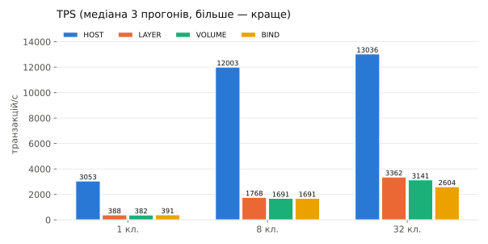
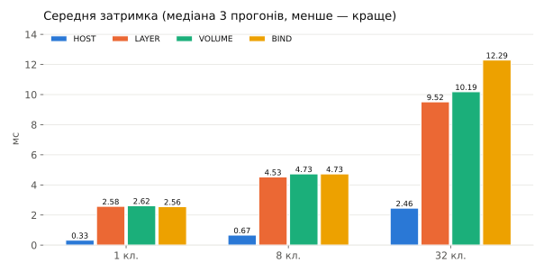
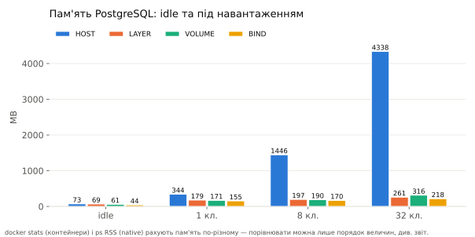
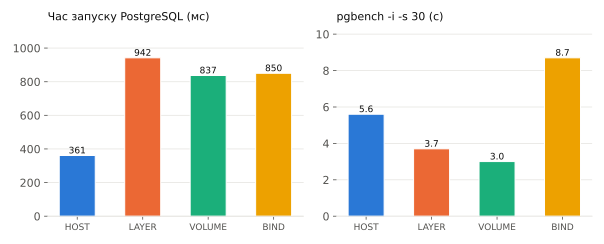

# PostgreSQL на macOS і в Docker Desktop: де живуть дані і що це коштує

## 1. Мета

Практично порівняти чотири способи запуску PostgreSQL на MacBook — нативний
процес macOS і три контейнерні варіанти з різним зберіганням даних — і
відповісти на питання:

- де фізично лежать дані PostgreSQL у кожному варіанті;
- що переживає restart, stop, видалення та повторне створення контейнера,
  а що — ні;
- чим writable layer відрізняється від named volume і bind mount;
- скільки коштує віртуалізація Docker Desktop на macOS у TPS, затримці,
  пам'яті та I/O;
- як виконуються та перевіряються backup і restore;
- який варіант доречний для development на MacBook, а який — для production.

Усі експерименти виконано на ізольованих лабораторних ресурсах із префіксом
`pg-lab-`; наявні кластери та контейнери машини не змінювались.

## 2. Опис середовища

| Компонент | Значення |
|---|---|
| Комп'ютер | MacBook Pro (MacBookPro18,3), Apple M1 Pro, 10 CPU (8P+2E), 32 GB RAM |
| macOS | 26.5.2 (build 25F84), файлова система APFS |
| Docker Desktop | 4.84.0; Engine 29.6.2 (linux/arm64), storage driver overlay2 |
| Ресурси Docker VM | 10 CPU, 7.65 GiB RAM, ядро 6.12.76-linuxkit |
| PostgreSQL native | 18.4 (Homebrew, `postgresql@18`) |
| Образ | `postgres:18.4`, digest `sha256:3a82e1f56c8f0f5616a11103ac3d47e632c3938698946a7ad26da0df1334744a`, arm64 |
| Клієнт для всіх вимірів | `psql`/`pgbench`/`pg_dump` 18.4 з Homebrew, TCP 127.0.0.1 |

**Важливо для інтерпретації всіх цифр.** Docker Desktop на macOS не запускає
контейнери «на маку»: він тримає легку Linux-VM (Apple Virtualization
framework), усередині якої працює Docker Engine. Отже контейнерний PostgreSQL
— це Linux-процес у VM, а «диск» контейнера — файл
`~/Library/Containers/com.docker.docker/Data/vms/0/data/Docker.raw`
(на цій машині — 60 GB). Benchmark тому вимірює не «Docker проти native», а
суму: Docker + віртуалізацію + шлях файлів/мережі між macOS і Linux VM.

Під час експериментів на машині працювали 11 сторонніх контейнерів
(здебільшого idle); вони не зупинялись із міркувань безпеки робочого
середовища — це зафіксовано в обмеженнях (розділ 10).

## 3. Схема чотирьох конфігурацій

Всюди однакова версія 18.4, заводська конфігурація (shared_buffers 128 MB),
`fsync`/`full_page_writes`/`synchronous_commit` увімкнені. Відрізняється лише
те, де живе PGDATA.

```text
HOST                          LAYER
┌─────────── macOS ─────────┐ ┌─────────── macOS ──────────────────────┐
│ postgres 18.4 (Homebrew)  │ │ Docker Desktop Linux VM                │
│ PGDATA:                   │ │ ┌─ контейнер pg-lab-layer ───────────┐ │
│  ~/pg-lab-data/host-pgdata│ │ │ PGDATA=/pgdata                     │ │
│ порт 127.0.0.1:5499       │ │ │  → WRITABLE LAYER (overlay2)       │ │
└───────────────────────────┘ │ │  гине разом із контейнером         │ │
                              │ └────────────────────────────────────┘ │
                              └────────────────────────────────────────┘
VOLUME                        BIND
┌─────────── macOS ─────────┐ ┌─────────── macOS ──────────────────────┐
│ Docker Desktop Linux VM   │ │ ~/pg-lab-data/bind-pgdata  (APFS)      │
│ ┌─ pg-lab-volume ───────┐ │ │        ▲ VirtioFS                      │
│ │ /var/lib/postgresql ◄─┼─┼─│ Docker Desktop Linux VM                │
│ └───────────────────────┘ │ │ ┌─ pg-lab-bind ──────────────────────┐ │
│ named volume              │ │ │ /var/lib/postgresql ◄─ bind mount  │ │
│ pg-lab-volume-data        │ │ └────────────────────────────────────┘ │
│ (усередині Docker.raw)    │ └────────────────────────────────────────┘
└───────────────────────────┘
```

| Варіант | Запуск | Зберігання | Порт |
|---|---|---|---:|
| `HOST` | окремий кластер `initdb` + `pg_ctl`, без brew services | каталог APFS користувача | 5499 |
| `LAYER` | `postgres:18.4`, `PGDATA=/pgdata` | writable layer контейнера (overlay2 у VM) | 5433 |
| `VOLUME` | `postgres:18.4` | named volume `pg-lab-volume-data` → `/var/lib/postgresql` | 5434 |
| `BIND` | `postgres:18.4` | bind mount `~/pg-lab-data/bind-pgdata` → `/var/lib/postgresql` | 5435 |

**Нюанс LAYER, без якого експеримент недійсний.** Образ `postgres` оголошує
`VOLUME /var/lib/postgresql`, тому контейнер «просто без mount» все одно
отримує *анонімний* volume, і дані переживають `docker rm` неочікуваним для
дослідження чином. Щоб дані справді жили у writable layer, `PGDATA`
винесено у `/pgdata` — поза оголошеним volume.

**Нюанс PostgreSQL 18.** Із версії 18 офіційний образ використовує
*версійний* PGDATA: точку монтування `/var/lib/postgresql` і каталог даних
`/var/lib/postgresql/18/docker` (це видно нижче в `SHOW data_directory`);
монтування у старий шлях `/var/lib/postgresql/data` образ відхиляє при
старті (див. розділ 9, ризик 1а).

## 4. Розташування даних

Реальний шлях у кожному варіанті перевірено запитом `SHOW data_directory`:

| Варіант | `SHOW data_directory` | Де це фізично |
|---|---|---|
| HOST | `/Users/aponomarov/pg-lab-data/host-pgdata` | звичайний каталог APFS; видно у Finder, бекапиться Time Machine |
| LAYER | `/pgdata` | writable layer overlay2 всередині Linux VM (файл `Docker.raw`) |
| VOLUME | `/var/lib/postgresql/18/docker` | `/var/lib/docker/volumes/pg-lab-volume-data/_data` всередині VM (файл `Docker.raw`); з macOS напряму недоступний |
| BIND | `/var/lib/postgresql/18/docker` | `~/pg-lab-data/bind-pgdata/18/docker` на APFS, прокинутий у VM через VirtioFS |

Спостереження щодо прав на bind mount: усередині контейнера файлами володіє
`postgres` (uid 999), але з боку macOS ті самі файли показуються як
`aponomarov (501)/staff` зі збереженим режимом `700` — VirtioFS мапить
власника на користувача Docker Desktop. Це зручно (файли читаються без
sudo), але означає, що Unix-права в контейнері та на хості — не одне й те
саме (розділ 9, ризик 2).

## 5. Результати lifecycle-тестів

Методика: у кожному кластері створено таблицю `lab_marker` з UUID-маркером;
після кожної дії перевірялось, чи живий саме цей маркер
(скрипт `scripts/30_lifecycle.sh`, повний лог `results/lifecycle.log`).

| Дія | HOST | LAYER | VOLUME | BIND |
|---|---|---|---|---|
| Restart PostgreSQL | збережено | збережено | збережено | збережено |
| Stop/start | збережено | збережено | збережено | збережено |
| Restart Docker Desktop | n/a | не виконувалось¹ | не виконувалось¹ | не виконувалось¹ |
| Видалення контейнера (`docker rm -f`) | n/a | **втрачено** | збережено² | збережено² |
| Повторне створення | n/a | **втрачено** | збережено | збережено |
| `docker compose down` | n/a | **втрачено** | збережено | збережено |
| `docker compose down -v` | n/a | **втрачено** | **втрачено** | збережено |

¹ Рестарт Docker Desktop зупинив би 11 сторонніх контейнерів на цій машині,
тому крок свідомо пропущено. Документована поведінка еквівалентна stop/start
усіх контейнерів: writable layer і volumes переживають перезапуск демона,
тож очікувані результати збігаються з рядком «Stop/start».

² «Збережено» тут означає: сховище (volume / каталог) пережило видалення
контейнера, і після повторного створення контейнера з тим самим
volume/каталогом маркер знову доступний.

**Чому restart ≠ видалення.** `docker restart`/`stop` зупиняє процес, але
контейнер (і його writable layer) продовжує існувати — тому навіть LAYER
переживає перезапуски. `docker rm` знищує контейнер *разом із writable
layer* — з цього моменту дані LAYER не існують ніде. `docker compose down`
за замовчуванням видаляє контейнери (звідси «втрачено» для LAYER), але
named volumes залишає; їх знищує лише явний прапорець `-v` або
`docker volume rm`.

**Чому volume — не резервна копія.** Named volume — це та сама «жива»
файлова система БД, просто з довшим життєвим циклом. Один необережний
`compose down -v` (див. рядок таблиці) знищує «основні дані» і «копію»
одночасно, бо це той самий об'єкт. Резервною копією є лише те, що лежить
окремо від Docker і пройшло перевірку відновленням (розділ 8).

## 6. Результати benchmark

Методика (`scripts/50_benchmark.sh`): `pgbench` 18.4 на macOS, підключення
до всіх варіантів через TCP `127.0.0.1`; scale factor 30 (~456 MB);
клієнти 1/8/32 (потоки `-j = min(c, 8)`); warm-up 10 с; кожна точка — три
прогони по 30 с, у таблицях **медіана**. Під час вимірювань працював лише
один лабораторний PostgreSQL. `fsync`, `full_page_writes`,
`synchronous_commit` — заводські. Disk I/O знято однаково для всіх
варіантів — із `pg_stat_io` (сума `read_bytes`/`write_bytes` за прогін).

### Службові виміри

| Варіант | Запуск PG, мс | `pgbench -i -s 30`, с | Пам'ять idle, MB | БД, MB | PGDATA, MB |
|---|---:|---:|---:|---:|---:|
| HOST | 361 | 5.6 | 73 | 456 | 1313¹ |
| LAYER | 942 | 3.7 | 69 | 456 | 864 |
| VOLUME | 837 | 3.0 | 61 | 456 | 864 |
| BIND | 850 | 8.7 | 44 | 456 | 879 |

¹ Розмір самої БД скрізь однаковий (456 MB); більший PGDATA у HOST — це
накопичені WAL-сегменти від попередніх етапів (lifecycle, backup, два
benchmark-прогони), а не «зайві» дані.

### Основні виміри (медіана трьох прогонів)

| Варіант | Клієнти | TPS | Затримка, мс | CPU, %² | I/O read, MB | I/O write, MB |
|---|---:|---:|---:|---:|---:|---:|
| HOST | 1 | 3053 | 0.33 | 59 | 723 | 1642 |
| HOST | 8 | 12003 | 0.67 | 320 | 2913 | 5245 |
| HOST | 32 | 13036 | 2.46 | 496 | 3329 | 5573 |
| LAYER | 1 | 388 | 2.58 | 17 | 91 | 234 |
| LAYER | 8 | 1768 | 4.53 | 118 | 415 | 953 |
| LAYER | 32 | 3362 | 9.52 | 259 | 790 | 1334 |
| VOLUME | 1 | 382 | 2.62 | 18 | 88 | 231 |
| VOLUME | 8 | 1691 | 4.73 | 114 | 400 | 880 |
| VOLUME | 32 | 3141 | 10.19 | 244 | 744 | 1315 |
| BIND | 1 | 391 | 2.56 | 20 | 96 | 237 |
| BIND | 8 | 1691 | 4.73 | 114 | 369 | 815 |
| BIND | 32 | 2604 | 12.29 | 207 | 612 | 1056 |

² CPU: для контейнерів — `docker stats` (може бути > 100%, це сума ядер);
для HOST — дельта CPU-часу дерева процесів постмастера за 3 с. Пам'ять під
навантаженням — на графіку в розділі 7, з великим застереженням із
розділу 10.

### Інтерпретація

- **Головний результат: три Docker-варіанти майже не відрізняються один від
  одного** (на 1 і 8 клієнтах — у межах 2–5%). Вузьке місце — не спосіб
  зберігання, а шлях кожного підключення: `127.0.0.1` → проксі
  port-forwarding Docker Desktop → Linux VM. Саме тому на 1 клієнті
  native швидший за будь-який контейнер у ~8 разів (3053 проти ~388 TPS,
  0.33 проти ~2.6 мс), хоча диск під усіма той самий.
- **Зі зростанням конкурентності розрив звужується** (латентність проксі
  перекривається паралелізмом): на 32 клієнтах native швидший уже в ~4 рази
  (13036 проти 2604–3362 TPS).
- **Різниця між сховищами проявляється лише під високою конкурентністю та
  на масовому записі:** на 32 клієнтах BIND (VirtioFS) відстає від
  LAYER/VOLUME на ~20% по TPS (2604 проти 3141–3362) і має найгіршу
  затримку (12.29 мс); ініціалізація `pgbench -i` на BIND утричі
  повільніша за VOLUME (8.7 с проти 3.0 с). Overlay2 (LAYER) і named
  volume (VOLUME) за швидкістю практично ідентичні — обидва живуть у
  файловій системі VM.
- **CPU підтверджує ту саму картину:** HOST на 32 клієнтах завантажує ~5
  ядер і робить 13k TPS; контейнери — ~2.5 ядра на ~3k TPS, решту часу
  транзакції стоять у черзі мережевого шляху, а не рахують.
- **Час запуску** контейнерів стабільно більший (~840–940 мс проти 361 мс
  native) — це ціна `docker start` + ініціалізації оточення контейнера,
  для dev-циклу несуттєва, для аварійного рестарту production — теж.

## 7. Графіки







Пам'ять на графіку вище — **різні метрики**: для контейнерів це cgroup
(`docker stats`, разом із file cache), для HOST — сума RSS процесів, яка
*багаторазово* враховує спільні сторінки shared buffers у кожному backend
(звідси нереалістичні 4.3 GB на 32 клієнтах). Коректне порівняння — лише
порядок величин і динаміка, не абсолютні числа (розділ 10).



## 8. Backup і restore

Методика (`scripts/45_backup_restore.sh`): у HOST і VOLUME додано тестову
таблицю на 2 000 000 рядків; далі `pg_dump -Fc` → створення *нового
порожнього* кластера (для HOST — другий `initdb` на порту 5498, для VOLUME —
новий контейнер із новим named volume) → `pg_restore` → перевірка маркера і
кількості рядків.

| Варіант | pg_dump | pg_restore | Рядків до → після | Маркер | Розмір дампа |
|---|---:|---:|---|---|---:|
| HOST | 3.1 с | 1.6 с | 2 000 000 → 2 000 000 | відновлено | 44 MB |
| VOLUME | 3.5 с | 1.5 с | 2 000 000 → 2 000 000 | відновлено | 43 MB |

Різниця між native і контейнером у межах похибки: у `pg_dump` вузьке місце —
серіалізація даних сервером, а не транспорт.

**Чому не можна просто скопіювати каталог працюючого PostgreSQL.** Файли
кластера змінюються неатомарно: сторінки таблиць, WAL і контрольний файл
копіюються в різні моменти часу, тож копія майже напевно внутрішньо
неузгоджена і може не запуститись або мовчки втратити транзакції. Коректні
варіанти — логічний дамп (`pg_dump`), `pg_basebackup`, або файлова копія
*зупиненого* кластера. І головне правило: **backup вважається робочим лише
після успішного тестового restore** — саме тому в методиці відновлення
виконується в новий порожній кластер із перевіркою вмісту.

## 9. Ризики втрати даних

Усі сценарії відтворено скриптом `scripts/40_risks.sh` (лог —
`results/risks.log`).

**Ризик 1а. Legacy mount point (звичка з PG ≤ 17).** Монтування named volume
у `/var/lib/postgresql/data` на образі `postgres:18.4` завершується
відмовою старту з поясненням:

```text
Error: in 18+, these Docker images are configured to store database data in a
       format which is compatible with "pg_ctlcluster" ...
       The suggested container configuration for 18+ is to place a single mount
       at /var/lib/postgresql ...
```

Це *захисна* поведінка (fail-fast): краще не стартувати, ніж мовчки розкласти
дані повз volume.

**Ризик 1б. «Тиха» версія тієї ж помилки.** Якщо ж named volume змонтовано
на шлях, який не збігається ні з PGDATA, ні з legacy-шляхом (у демо —
`/var/lib/pgsql`, типова одруківка), контейнер стартує *без жодних помилок*,
але БД живе в анонімному volume, створеному образом. Після
`docker rm -f -v` + повторного запуску з тим самим named volume таблиці
немає (`to_regclass('lab_marker')` → `f`): «volume підключений, дані
втрачені». Це найпідступніший сценарій, бо помилки не видно, доки не стане
пізно.

**Ризик 2. Права доступу на bind mount.** Каталог macOS із правами
`dr-xr-xr-x` (555): контейнер падає з
`mkdir: cannot create directory '/var/lib/postgresql/18': Permission denied`.
Правильне виправлення — дати власнику `700` (PostgreSQL сам вимагає
`700/750` на PGDATA), а не `chmod 777`: «відкрити все всім» лише маскує
проблему і робить каталог БД доступним для запису будь-якому локальному
процесу.

**Ризик 3. Bind mount прив'язаний до конкретного шляху.** Одруківка в шляху
(`bind-pgdataTYPO`) не дає помилки: Docker мовчки *створює порожній каталог*,
PostgreSQL чесно ініціалізує в ньому новий кластер — і застосунок бачить
порожню базу. Виглядає як «усі дані зникли», хоча реальні дані неушкоджені
лежать у сусідньому каталозі. Той самий механізм робить BIND-конфігурацію
непереносною: compose-файл із абсолютним шляхом `/Users/...` не запуститься
ідентично на іншій машині.

**Ризик 4. `docker compose down -v`.** Один прапорець знищує named volumes
проєкту разом із контейнерами (рядок 7 таблиці lifecycle). Виправдано лише
для свідомого «знести лабораторію повністю»; у проєкті з реальними даними
цей прапорець має бути під забороною в документації команди.

**Видалення контейнера ≠ видалення volume.** `docker rm` знищує контейнер і
його writable layer, але named volumes лишаються (їх видно в
`docker volume ls`, і дані повертаються після перепідключення). Симетрично,
`docker volume rm` можливий лише коли volume не використовується контейнером.
Ця асиметрія — причина, чому LAYER втрачає дані при `rm`, а VOLUME — ні.

## 10. Обмеження експерименту на Docker Desktop

1. **Це не Linux-production.** Контейнери працюють у Linux-VM Docker Desktop;
   мережа до них проходить через проксі port-forwarding, файли bind mount —
   через VirtioFS. На Linux-сервері з нативним Docker цих двох накладних
   шарів немає, тому *абсолютні* цифри з macOS не переносяться на
   production; переносяться якісні висновки (порівняння варіантів зберігання
   між собою всередині Docker).
2. **Метрики пам'яті не еквівалентні.** `docker stats` показує пам'ять
   cgroup контейнера (включно з file cache), а `ps` RSS на macOS не
   атрибутує процесам спільну пам'ять (shared buffers) — тому «18 MB» HOST
   проти «сотень MB» контейнерів порівнювати можна лише як порядок величин.
3. **Фонове навантаження.** 11 сторонніх контейнерів (переважно idle) не
   зупинялись; лабораторні PostgreSQL під час benchmark працювали строго по
   одному.
4. **Restart Docker Desktop пропущено** (пояснення в розділі 5).
5. **Один прогін конфігурації апаратури.** Масштаб pgbench 30, 30-секундні
   інтервали, 3 повтори — достатньо для порівняння варіантів, але не для
   абсолютних паспортних цифр.

## 11. Підсумкова рекомендація

Оцінка за критеріями (не лише TPS); ● — добре, ◐ — прийнятно з
застереженнями, ○ — погано:

| Критерій | HOST | LAYER | VOLUME | BIND |
|---|:-:|:-:|:-:|:-:|
| Збереження даних при житті контейнера | ● | ○ | ● | ● |
| Прозорість розташування файлів | ● | ○ | ◐¹ | ● |
| Простота backup/restore | ● | ◐ | ● | ● |
| Ризик випадкового видалення | ●² | ○ | ◐³ | ●⁴ |
| Продуктивність на цій машині | ● | ◐ | ◐ | ◐⁵ |
| Переносимість конфігурації | ○ | ● | ● | ◐⁶ |
| Складність оновлення PostgreSQL | ◐⁷ | ● | ● | ● |
| Зручність діагностики | ● | ◐ | ◐ | ◐ |
| Незалежність від Docker Desktop | ● | ○ | ○ | ◐⁸ |

¹ шлях відомий (`docker volume inspect`), але фізично файли в VM і з macOS
недоступні; ² захищений хіба що від `rm -rf` каталогу; ³ гине від
`compose down -v` / `volume rm`; ⁴ каталог переживає будь-які операції
Docker, але вразливий до одруківки в шляху (ризик 3); ⁵ найповільніший на
запису під конкурентністю; ⁶ compose-файл тягне за собою абсолютний шлях;
⁷ прив'язка до Homebrew-формули й ручного `pg_upgrade`; ⁸ дані читаються і
без Docker, але запускати БД ним же.

**Висновки з вимірів цієї лабораторії:**

1. **Writable layer для PostgreSQL непридатний ні для чого, крім одноразових
   експериментів.** Він не дає ні швидкості (та сама VM), ні збереження:
   будь-який `docker rm` / `compose down` — і БД більше не існує.
2. **Named volume — правильний Docker-варіант за замовчуванням.** Дані
   переживають весь життєвий цикл контейнера, окрім явного знищення volume;
   швидкість не поступається writable layer; конфігурація переносима.
   Обов'язкові супутники — перевірений backup (розділ 8) і дисципліна щодо
   `down -v`.
3. **Bind mount на macOS — інструмент прозорості, а не швидкості.** Файли
   БД видно у Finder і Time Machine, але на масовому записі VirtioFS
   утричі повільніший (init), під конкурентністю — −20% TPS і найгірша
   затримка; додаються ризики прав і одруківок у шляхах.
4. **Для щоденної розробки на цьому MacBook native PostgreSQL відчутно
   швидший і простіший**: у 8 разів нижча затримка на одиночних
   підключеннях (типовий патерн локальної розробки), моментальний запуск,
   файли поруч. Ціна — ручне управління версіями і непереносимість
   оточення. Якщо команда стандартизує оточення через compose — Docker з
   named volume лишається розумним компромісом.
5. **Для центральної production-бази на окремій Linux-VM попередньо
   рекомендується native PostgreSQL** (systemd-сервіс із локальним
   диском): менше шарів між БД і диском, штатні механізми оновлення й
   діагностики. PostgreSQL у Docker з named volume **також допустимий**,
   якщо в команді вже є перевірені backup/restore, моніторинг і процедура
   оновлення образів. Важливо: це попередня рекомендація — наші цифри
   зняті на Docker Desktop (macOS) і кількісно на Linux-production не
   переносяться (розділ 10); там накладні витрати Docker значно менші, і
   рішення варто ухвалювати за власним бенчмарком на цільовій платформі.

## Джерела

1. PostgreSQL: документація з надійності та WAL —
   <https://www.postgresql.org/docs/18/wal-reliability.html>
2. PostgreSQL: pg_dump / pg_restore —
   <https://www.postgresql.org/docs/18/app-pgdump.html>,
   <https://www.postgresql.org/docs/18/app-pgrestore.html>
3. PostgreSQL: pgbench — <https://www.postgresql.org/docs/18/pgbench.html>
4. Docker: Volumes — <https://docs.docker.com/engine/storage/volumes/>
5. Docker: Bind mounts — <https://docs.docker.com/engine/storage/bind-mounts/>
6. Docker Desktop for Mac: архітектура і файлове ширення —
   <https://docs.docker.com/desktop/features/vmm/>
7. Офіційний образ postgres (Docker Hub) —
   [`hub.docker.com/_/postgres`](https://hub.docker.com/_/postgres)
8. Зміна розкладки PGDATA у postgres:18 —
   <https://github.com/docker-library/postgres/pull/1259>
